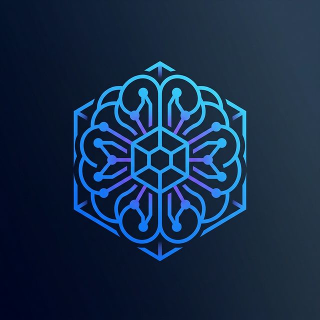
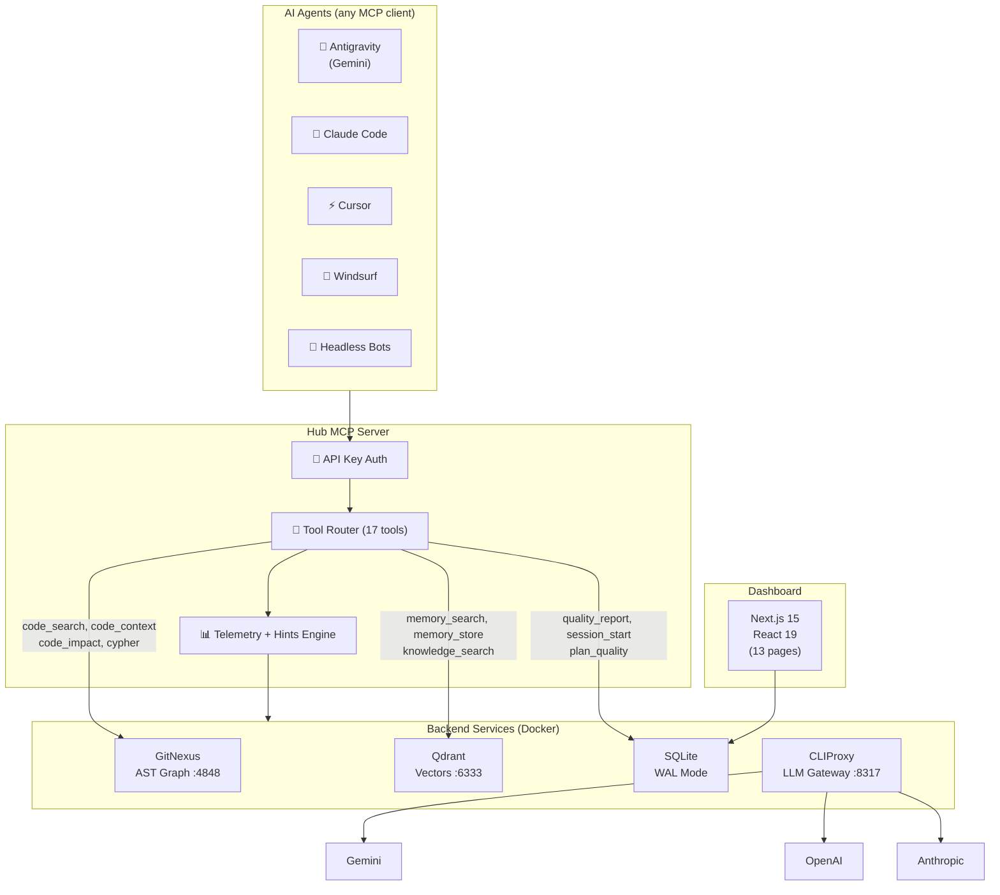
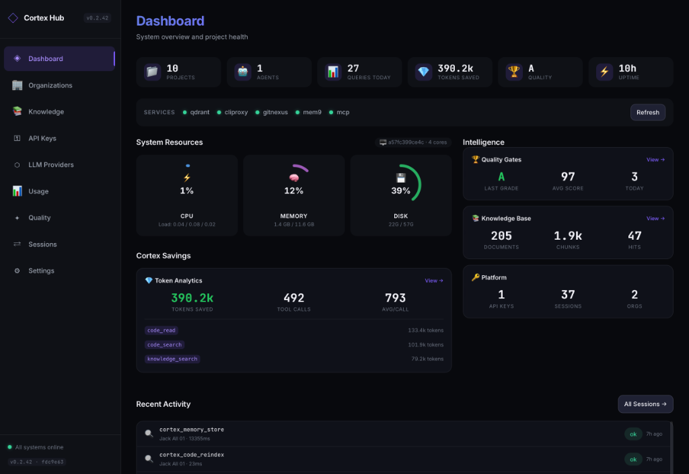
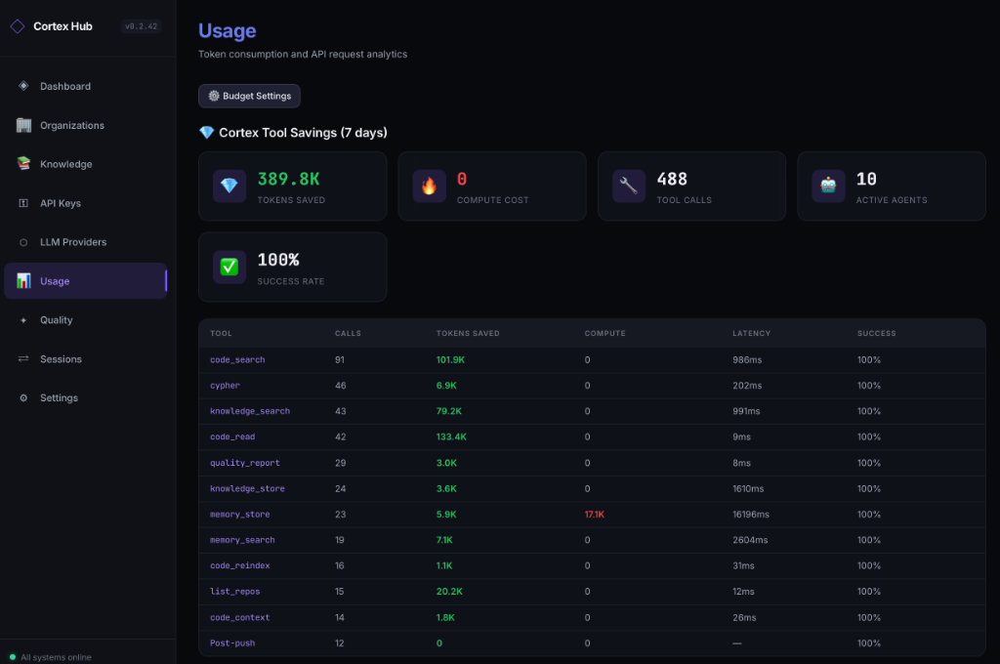

<p align="center">
  <picture>
    <source media="(prefers-color-scheme: dark)" srcset="docs/assets/logo.png">
    
  </picture>
</p>

<h1 align="center">Cortex Hub</h1>

<p align="center">
  <strong>Self-hosted AI Agent Intelligence Platform</strong><br/>
  <em>Unified MCP gateway · Persistent memory · Code intelligence · Quality enforcement</em>
</p>

<p align="center">
  <a href="#why-cortex">Why Cortex</a> ·
  <a href="#architecture">Architecture</a> ·
  <a href="#features">Features</a> ·
  <a href="#quick-start">Quick Start</a> ·
  <a href="#mcp-tools">MCP Tools</a> ·
  <a href="#docs">Docs</a>
</p>

<p align="center">
  
  
  
  
  
  
</p>

---

## Why Cortex?

Every AI coding agent today works in **isolation** — no shared memory, no knowledge transfer, no quality tracking. When you switch between Claude Code, Cursor, Gemini, or a headless bot, each starts from zero.

**Cortex Hub** solves this by providing a single self-hosted backend that **all your agents connect to** via the [Model Context Protocol (MCP)](https://modelcontextprotocol.io/):

```
                    You
                     │
        ┌────────────┼────────────┐
        ▼            ▼            ▼
   Claude Code    Cursor     Antigravity
        │            │            │
        └────────────┼────────────┘
                     │
              ┌──────▼──────┐
              │  Cortex Hub │  ← single MCP endpoint
              │             │
              │  Memory     │  Agents remember across sessions
              │  Knowledge  │  Shared, searchable knowledge base
              │  Code Intel │  AST-aware search + impact analysis
              │  Quality    │  Build/typecheck/lint enforcement
              │  Sessions   │  Cross-agent task handoff
              └─────────────┘
```

> **Zero data leaves your infrastructure.** Every component runs on your own server behind a Cloudflare Tunnel.

---

## Architecture



> **Note:** mem9 (embedding pipeline) runs in-process within the Dashboard API container — not as a separate service. It connects to Qdrant for vector storage.

### Network Topology

```
Internet
  │
  ├── cortex-mcp.jackle.dev ──── Hub MCP Server (Hono, Streamable HTTP)
  └── hub.jackle.dev ─────────── Dashboard UI (Nginx proxied to /api/)
                                    │
                              Cloudflare Tunnel
                                    │
                          ┌─────────┼─────────┐
                          │  Docker Compose    │
                          │  ├─ dashboard-web  │  ← Nginx (UI + API Proxy)
                          │  ├─ cortex-api     │  ← Internal API + mem9
                          │  ├─ cortex-mcp     │  ← 17 MCP tools
                          │  ├─ qdrant         │  ← vectors + knowledge
                          │  ├─ gitnexus       │  ← AST code graph
                          │  ├─ llm-proxy      │  ← CLIProxy (internal)
                          │  └─ watchtower     │  ← auto-update images
                          └────────────────────┘
                          All ports internal.
                          Zero open ports on host.
```

---

## Features

### 🧠 Code Intelligence — GitNexus

| Capability | Tool | How It Works |
|---|---|---|
| **Semantic code search** | `cortex_code_search` | Natural language → AST-aware execution flows across all repos |
| **360° symbol context** | `cortex_code_context` | Every caller, callee, import chain for any function/class |
| **Blast radius analysis** | `cortex_code_impact` | See downstream impact before editing any symbol |
| **Pre-commit risk** | `cortex_detect_changes` | Analyze uncommitted changes, find affected flows |
| **Graph queries** | `cortex_cypher` | Direct Cypher queries against the code knowledge graph |
| **Multi-repo indexing** | `cortex_list_repos` | All repositories in a single graph, discoverable by agents |
| **Auto-reindexing** | `cortex_code_reindex` | Trigger re-indexing after code changes |

### 💾 Persistent Agent Memory

Agents **remember** across sessions and conversations.

```
Session 1 (Claude Code):  "The auth middleware uses JWT with RS256"
                                    ↓ cortex_memory_store
Session 2 (Cursor):        cortex_memory_search("auth middleware") 
                                    → "JWT with RS256" ✓
```

- Per-agent and per-project isolation with optional shared spaces
- Semantic recall (search by meaning, not keywords)
- Scoped to branch — agents on `feature/auth` recall branch-specific context
- Automatic deduplication and relevance ranking

### 📚 Shared Knowledge Base — Qdrant

Agents contribute and consume a team-wide knowledge base:

- **Auto-contribution** — agents store bug fixes, patterns, and decisions during work
- **Semantic search** — find relevant knowledge by concept, not exact match
- **Tag & project filtering** — organized by domain and repository
- **Cross-project sharing** — deployment patterns, API conventions, etc.
- **Auto-docs pipeline** — index repo docs → mem9 embed → auto-build knowledge items

### 🔀 LLM API Gateway

Centralized proxy for all LLM/embedding calls:

- **Multi-provider** — Gemini, OpenAI, Anthropic, or any OpenAI-compatible API
- **Ordered fallback chains** — automatic retry on 429 / 502 / 503 / 504
- **Gemini ↔ OpenAI format translation** — handled transparently
- **Budget enforcement** — daily/monthly token limits from Dashboard
- **Usage logging** — exact token counts per agent, model, and day
- **Complexity-based routing** — `model: "auto"` auto-selects tier based on task complexity
- **OpenAI-compatible** — `/v1/embeddings` + `/v1/chat/completions`

### 🛡️ Quality Gates

4-dimension scoring after every work session:

| Dimension | Weight | What It Measures |
|-----------|--------|-----------------|
| Build | 25 | Code compiles without errors |
| Regression | 25 | No existing tests broken |
| Standards | 25 | Follows code-conventions.md |
| Traceability | 25 | Changes linked to requirements |

Grades A→F with trend tracking. Auto-generated git hooks via `project-profile.json`.

### 🔄 Session Handoff

One agent picks up where another left off:

- **Structured context** — files changed, decisions made, blockers
- **API key tracking** — see which key initiated each session
- **Priority queue** — pick up the most important work first
- **Auto-expiry** — stale handoffs expire after 7 days

### 📊 Dashboard


*System overview and project health tracking.*


*Token consumption and API request analytics.*

Real-time monitoring and management (13 pages):

- **Overview** — hero stats bar + per-project cards with GitNexus/mem9 status
- **Sessions** — agent session list with API key tracking + detail panel
- **Quality** — quality reports with grade trending (A→F) + trends chart
- **Projects** — repo management, branch-aware indexing, embedding status
- **Knowledge** — browse and search the shared knowledge base
- **Providers** — LLM provider management: add/test/configure, smart model discovery
- **Usage** — token consumption by model, agent, time period + budget controls
- **Keys** — API key management with per-key permissions
- **Organizations** — multi-tenant org management
- **Settings** — system configuration + version info
- **Setup** — first-time wizard with provider configuration
- Mobile-responsive: hamburger sidebar, 3-tier CSS breakpoints

### 🔒 Compliance Enforcement

Automatic tool usage tracking and guidance:

- **Session compliance score** — graded A/B/C/D at session end across 5 categories (Discovery, Safety, Learning, Contribution, Lifecycle)
- **Context-aware hints** — MCP responses include smart suggestions for what tool to use next
- **Quality gates** — 4D scoring (Build/Regression/Standards/Traceability) with A→F grades
- **Plan quality assessment** — `cortex_plan_quality` scores plans against 8 criteria before execution

---

## MCP Tools

Cortex exposes **17 tools** via a single MCP endpoint. Any MCP-compatible client can use them:

| # | Tool | Purpose |
|---|------|---------|
| 1 | `cortex_session_start` | Start a development session, get project context |
| 2 | `cortex_session_end` | Close session with compliance grade |
| 3 | `cortex_changes` | Check for unseen code changes from other agents |
| 4 | `cortex_code_search` | AST-aware semantic code search (GitNexus) |
| 5 | `cortex_code_context` | 360° symbol view: callers, callees, execution flows |
| 6 | `cortex_code_impact` | Blast radius analysis before editing |
| 7 | `cortex_code_reindex` | Trigger re-indexing after code changes |
| 8 | `cortex_list_repos` | List indexed repos with project ID mapping |
| 9 | `cortex_cypher` | Direct Cypher queries against code knowledge graph |
| 10 | `cortex_detect_changes` | Pre-commit risk analysis on uncommitted changes |
| 11 | `cortex_memory_search` | Recall agent memories by semantic similarity |
| 12 | `cortex_memory_store` | Store findings for future recall |
| 13 | `cortex_knowledge_search` | Search shared knowledge base |
| 14 | `cortex_knowledge_store` | Contribute bug fixes, patterns, decisions |
| 15 | `cortex_quality_report` | Report build/typecheck/lint results (4D scoring) |
| 16 | `cortex_plan_quality` | Assess implementation plan quality before execution |
| 17 | `cortex_health` | Check all backend service health |

> **Full API reference:** [`docs/api/hub-mcp-reference.md`](docs/api/hub-mcp-reference.md)

---

## Quick Start

### Prerequisites

- Docker 24+ with Compose v2
- Node.js 22 LTS
- pnpm 9.x
- A Cloudflare account (free tier)

### One-Command Install

**macOS / Linux:**
```bash
curl -fsSL https://raw.githubusercontent.com/lktiep/cortex-hub/master/scripts/bootstrap.sh | bash
```

**Windows (PowerShell):**
```powershell
iwr -useb https://raw.githubusercontent.com/lktiep/cortex-hub/master/scripts/onboard.ps1 -OutFile onboard.ps1; .\onboard.ps1
```

The bootstrap script offers two modes:

| Mode | Who | What It Does |
|------|-----|-------------|
| **Administrator** | Server owner | Full Docker stack, infra, tunnel setup |
| **Member** | Team dev | Connects local agent to an existing Hub |

### Manual Setup

```bash
# 1. Clone
git clone https://github.com/lktiep/cortex-hub.git
cd cortex-hub

# 2. Install
corepack enable && pnpm install

# 3. Configure
cp .env.example .env
# Edit .env with your API keys (Gemini, OpenAI, etc.)

# 4. Start backend
cd infra && docker compose up -d

# 5. Build & run
pnpm build && pnpm dev
```

### Connect Your Agent (Member Install)

Connect your IDE agent to an existing Cortex Hub — **no need to clone the repo**:

**macOS / Linux:**
```bash
bash <(curl -fsSL https://raw.githubusercontent.com/lktiep/cortex-hub/master/scripts/onboard.sh)
```

**Windows (PowerShell):**
```powershell
iwr -useb https://raw.githubusercontent.com/lktiep/cortex-hub/master/scripts/onboard.ps1 -OutFile onboard.ps1
.\onboard.ps1
```

Or with API key pre-configured:

```bash
# macOS/Linux
HUB_API_KEY=your-key bash <(curl -fsSL https://raw.githubusercontent.com/lktiep/cortex-hub/master/scripts/onboard.sh) --tool antigravity
```
```powershell
# Windows
$env:HUB_API_KEY = "your-key"; .\onboard.ps1 -Tool antigravity
```

The onboarding script will:
- ✅ Inject MCP config into your IDE (Claude, Cursor, Windsurf, VS Code, Gemini)
- ✅ Generate `.cortex/project-profile.json` with verify commands
- ✅ Install Lefthook git hooks (pre-commit + pre-push)
- ✅ Deploy workflow templates (`.agents/workflows/`)
- ✅ Generate agent rules (`.cortex/agent-rules.md`)

### Verify

```bash
curl https://cortex-api.jackle.dev/health     # Dashboard API
curl https://cortex-mcp.jackle.dev/health     # MCP Server
```

---

## Tech Stack

| Layer | Technology | Role |
|---|---|---|
| **MCP Server** | Hono (Node.js, Docker) | Streamable HTTP + JSON-RPC gateway (17 tools) |
| **Code Intel** | GitNexus | AST parsing, execution flow, impact analysis, Cypher graph |
| **Embeddings** | mem9 + Qdrant | In-process embedding pipeline → vector search |
| **LLM Proxy** | CLIProxy | Multi-provider gateway with fallback chains |
| **App DB** | SQLite (WAL) | Sessions, quality, usage, providers, budgets, orgs |
| **API** | Hono | Dashboard backend REST API + mem9 in-process |
| **Frontend** | Next.js 15 + React 19 | Dashboard web interface (static export, 13 pages) |
| **Infra** | Docker Compose | Service orchestration |
| **Tunnel** | Cloudflare Tunnel | Secure exposure, zero open ports |
| **Hooks** | Lefthook | Git hooks from `project-profile.json` |
| **Monorepo** | pnpm + Turborepo | Build orchestration + caching |

---

## Project Structure

```
cortex-hub/
├── apps/
│   ├── hub-mcp/                 # MCP Server (Hono, Streamable HTTP)
│   │   └── src/tools/           #   17 MCP tools (code, memory, knowledge, quality, session, analytics)
│   ├── dashboard-api/           # Dashboard Backend (Hono + SQLite + mem9)
│   │   ├── routes/llm.ts        #   LLM Gateway (multi-provider proxy + complexity routing)
│   │   ├── routes/quality.ts    #   Quality gates + session handoffs
│   │   ├── routes/stats.ts      #   Analytics, telemetry, compliance scoring, hints engine
│   │   ├── routes/intel.ts      #   Code intelligence proxy (GitNexus)
│   │   └── routes/knowledge.ts  #   Knowledge base management
│   └── dashboard-web/           # Dashboard Frontend (Next.js 15)
│       └── src/app/             #   13 pages: dashboard, sessions, quality, orgs, ...
├── packages/
│   ├── shared-types/            # TypeScript type definitions
│   ├── shared-utils/            # Logger, error classes, common utilities
│   └── shared-mem9/             # Embedding pipeline + vector store client
├── infra/
│   ├── docker-compose.yml       # Full stack: Qdrant, GitNexus, CLIProxy, API, MCP, Watchtower
│   ├── Dockerfile.dashboard-api #   API + mem9 in-process
│   ├── Dockerfile.hub-mcp       #   MCP server
│   ├── Dockerfile.dashboard-web #   Next.js static export
│   └── Dockerfile.gitnexus      #   GitNexus eval-server
├── scripts/
│   ├── bootstrap.sh             # One-command install (admin + member modes)
│   ├── install-hub.sh           # Full server setup (Docker, Cloudflare, services)
│   ├── onboard.sh               # Universal agent onboarding — macOS/Linux
│   ├── onboard.ps1              # Universal agent onboarding — Windows
│   ├── uninstall.sh             # Clean uninstall for fresh re-testing
│   └── bump-version.sh          # Version management (patch/minor/major)
├── templates/
│   └── workflows/               # Portable workflow templates for any project
├── docs/                        # Architecture, API reference, guides, use-cases
├── .cortex/                     # Project profile + code conventions
└── .agents/workflows/           # Active workflow definitions (/code, /continue, /phase)
```

---

## Docs

| Document | Description |
|---|---|
| [`docs/architecture/overview.md`](docs/architecture/overview.md) | System architecture with Mermaid diagrams |
| [`docs/architecture/llm-gateway.md`](docs/architecture/llm-gateway.md) | LLM Gateway: fallback chains, budget, usage |
| [`docs/architecture/monorepo-structure.md`](docs/architecture/monorepo-structure.md) | Package graph and dependency flow |
| [`docs/architecture/agent-quality-strategy.md`](docs/architecture/agent-quality-strategy.md) | Quality gates, scoring, and enforcement |
| [`docs/api/hub-mcp-reference.md`](docs/api/hub-mcp-reference.md) | Full MCP tool API reference |
| [`docs/api/database-schema.md`](docs/api/database-schema.md) | Database schema reference |
| [`docs/database/erd.md`](docs/database/erd.md) | Entity-relationship diagram |
| [`docs/guides/installation.md`](docs/guides/installation.md) | Full installation guide |
| [`docs/guides/onboarding.md`](docs/guides/onboarding.md) | Agent onboarding walkthrough |
| [`docs/guides/use-cases.md`](docs/guides/use-cases.md) | Use cases, comparison, system requirements |
| [`.cortex/code-conventions.md`](.cortex/code-conventions.md) | Code conventions and standards |

---

## Roadmap

| Phase | What Was Built | Status |
|---|---|---|
| **Phase 1** | Ubuntu server provisioning, Docker 24+, Cloudflare Tunnel (`cloudflared`) | ✅ |
| **Phase 2** | pnpm + Turborepo monorepo, `shared-types`, `shared-utils`, `shared-mem9` packages | ✅ |
| **Phase 3** | Docker Compose stack: Qdrant, GitNexus eval-server, LLM Proxy, Watchtower | ✅ |
| **Phase 4** | Hub MCP Server: 17 tools, Streamable HTTP, API key auth, telemetry, compliance | ✅ |
| **Phase 5** | Dashboard: 12 pages, LLM Gateway, quality reports, sessions, usage analytics | ✅ |
| **Phase 6** | Polish, documentation, testing, GA release | 🔄 |

### What's Built (Highlights)

**Infrastructure**
- ✅ 2-service Docker architecture: `cortex-api` (:4000) + `cortex-mcp` (:8317)
- ✅ Pre-built Docker images on GHCR (`ghcr.io/lktiep/cortex-*:latest`)
- ✅ Cloudflare Tunnel: 4 subdomains, zero open ports
- ✅ Watchtower auto-updates for Docker images
- ✅ Docker build optimization: cache mounts, shared base, `.dockerignore`

**MCP Server (17 tools)**
- ✅ Streamable HTTP transport (JSON-RPC over POST, SSE for streaming)
- ✅ API key auth with `X-API-Key-Owner` identity resolution
- ✅ Global telemetry: every tool call logged with agent, latency, project
- ✅ Code intelligence: `code_search`, `code_context`, `code_impact`, `code_reindex`, `list_repos`, `cypher`, `detect_changes` (GitNexus)
- ✅ Agent memory: `memory_search`, `memory_store` (mem9 → Qdrant)
- ✅ Knowledge base: `knowledge_search`, `knowledge_store` (Qdrant)
- ✅ Sessions: `session_start`, `session_end`, `changes`, `health`
- ✅ Quality: `quality_report` with 4D scoring + `plan_quality` assessment
- ✅ Compliance enforcement: session compliance grading (A/B/C/D) + context-aware hints

**Dashboard (13 pages)**
- ✅ Hero stats bar + per-project overview cards with GitNexus/mem9 status
- ✅ LLM provider management: add/test/configure, smart model discovery
- ✅ Usage analytics: token consumption by model, agent, time period
- ✅ Budget controls: daily/monthly limits with alert thresholds
- ✅ Quality reports with grade trending (A→F) + trends chart
- ✅ Session list with API key tracking + detail panel
- ✅ Project management with Git integration + branch-aware indexing
- ✅ Knowledge base browser + search
- ✅ API key management with per-key permissions
- ✅ Organization/multi-tenant management
- ✅ Auto-docs knowledge: scans repo docs after indexing → builds knowledge items
- ✅ Mobile-responsive: hamburger sidebar, 3-tier CSS breakpoints

**LLM API Gateway (CLIProxy)**
- ✅ Multi-provider: Gemini, OpenAI, Anthropic, any OpenAI-compatible
- ✅ Ordered fallback chains with auto-retry (429/502/503/504)
- ✅ Gemini ↔ OpenAI format translation
- ✅ Complexity-based model routing (`model: "auto"`)
- ✅ Budget enforcement with daily/monthly token limits
- ✅ Usage logging per agent, model, day

**Developer Experience**
- ✅ Universal onboarding: supports Claude Code, Cursor, Windsurf, VS Code, Gemini, OpenAI Codex, headless bots
- ✅ **Windows support**: `onboard.ps1` — full PowerShell equivalent of `onboard.sh`
- ✅ Remote install: `bash <(curl ...)` or `iwr | .\onboard.ps1` — no clone needed
- ✅ Lefthook git hooks auto-generated from `project-profile.json`
- ✅ Workflow templates deployed to any project (code, continue, phase)
- ✅ Agent-facing rules auto-generated (`.cortex/agent-rules.md`)
- ✅ Auto-docs knowledge pipeline: index repo → mem9 embed → scan docs → build knowledge

**CI/CD & Operations**
- ✅ GitHub Actions: CI (lint + typecheck + test) on every push/PR
- ✅ GitHub Actions: Docker build → GHCR publish with auto version bump
- ✅ Watchtower auto-update: server pulls new images automatically

### Planned

- [ ] Agent performance leaderboard
- [ ] Plugin system for custom MCP tools

---

## System Requirements

| Resource | Minimum | Recommended | Notes |
|----------|---------|-------------|-------|
| **CPU** | 2 vCPU | 4 vCPU | Qdrant vector search is CPU-intensive |
| **RAM** | 4 GB | 8 GB | Qdrant + GitNexus + Node.js services |
| **Disk** | 20 GB | 50 GB | Vector indices grow with knowledge base |
| **OS** | Ubuntu 22.04+ | Ubuntu 24.04 LTS | Any Linux with Docker 24+ |

**Best value hosting:** Hetzner CX22 (~$4.50/mo) handles 3-5 agents comfortably.

> 📖 Full requirements, cloud cost comparison, and capacity planning: [`docs/guides/use-cases.md`](docs/guides/use-cases.md#system-requirements)

---

## Cost

Cortex runs on **near-zero** infrastructure cost — everything is self-hosted:

| Component | Cost | Notes |
|---|---|---|
| Linux server | Your existing hardware or VPS | Any machine with Docker (from $4.50/mo) |
| Cloudflare Tunnel | Free | Secure exposure, no open ports |
| Qdrant | Free | Self-hosted in Docker |
| GitNexus | Free | Self-hosted code intelligence |
| mem9 | Free | Self-hosted embedding pipeline |
| Dashboard | Free | Next.js static export, served by API |
| LLM API calls | Pay-per-use | Your own keys, budget-controlled |
| **Total** | **~$5/mo + LLM token usage** | |

---

## Why Cortex? (Use Cases)

| Scenario | Without Cortex | With Cortex | Savings |
|----------|---------------|-------------|----------|
| **Context switching** | Re-explain everything each session | `memory_search` → instant recall | ~1 hour/day |
| **Known bug hits** | Debug from scratch (30 min) | `knowledge_search` → 2 seconds | 30 min/bug |
| **Code navigation** | `grep` → 50 results, ~50K tokens | `code_search` → 3 flows, ~5K tokens | ~90% tokens |
| **Multi-agent conflicts** | Manual merge resolution | Change detection prevents conflicts | 20+ min/incident |
| **Quality assurance** | Hope agent ran linter | 4D scoring + compliance grading | Catches issues pre-commit |

> 📖 Detailed use cases with examples: [`docs/guides/use-cases.md`](docs/guides/use-cases.md)

### Cortex Hub vs Standalone Tools (GitNexus + mem0)

| Aspect | Standalone | Cortex Hub |
|--------|-----------|------------|
| **Setup** | Install each tool per machine | One `docker compose up` |
| **Memory** | Per-machine, lost on reset | Persistent, server-side |
| **Knowledge sharing** | None | All agents share one base |
| **Multi-repo search** | One repo per instance | Cross-project graph |
| **Agent coordination** | Blind | Session tracking + change detection |
| **Quality tracking** | None | 4D scoring + compliance grades |
| **Team scaling** | Re-setup per member | One-command onboard |

> 📖 Full comparison with tradeoffs: [`docs/guides/use-cases.md#cortex-hub-vs-standalone-tools`](docs/guides/use-cases.md#cortex-hub-vs-standalone-tools)

---

## Contributing

See the [Contributing Guide](docs/CONTRIBUTING.md) for development setup, commit conventions, and code standards.

## License

MIT © Cortex Hub Contributors

