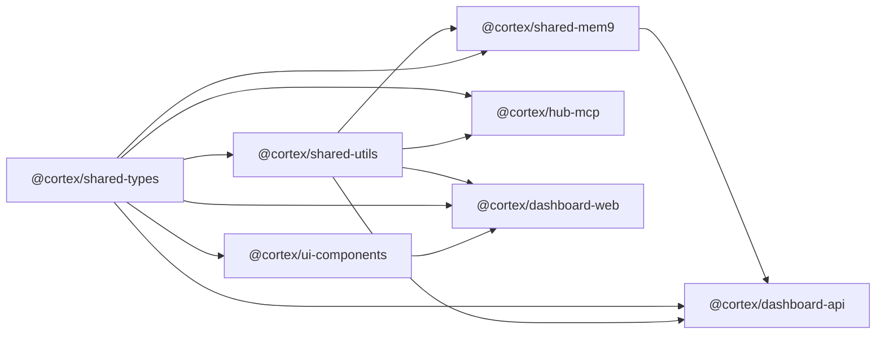

# Monorepo Structure

> Cortex uses a **pnpm workspace + Turborepo** monorepo. All packages share types, utilities, and build pipelines.

---

## Directory Layout

```
cortex-hub/
├── packages/                           # Shared libraries
│   ├── shared-types/                   # TypeScript type definitions
│   │   └── src/
│   │       ├── api.ts                  # Request/response contracts
│   │       ├── models.ts              # Domain models (Knowledge, Quality, Session)
│   │       ├── mcp.ts                 # MCP protocol types
│   │       └── index.ts
│   ├── shared-utils/                   # Common utility functions
│   │   └── src/
│   │       ├── crypto.ts              # API key hashing, token generation
│   │       ├── date.ts                # Date formatting helpers
│   │       ├── logger.ts              # Structured logging (pino)
│   │       ├── validation.ts          # Zod schemas (shared)
│   │       └── index.ts
│   ├── shared-mem9/                    # Memory engine (in-process)
│   │   └── src/
│   │       ├── types.ts               # Mem9Config, MemoryItem, etc.
│   │       ├── embedder.ts            # Gemini/OpenAI embedding client
│   │       ├── vector-store.ts        # Qdrant REST client
│   │       ├── prompts.ts             # Fact extraction + dedup prompts
│   │       ├── llm.ts                 # CLIProxy chat completions
│   │       ├── memory.ts              # Core Mem9 class
│   │       ├── history.ts             # SQLite audit trail
│   │       └── index.ts
│   └── ui-components/                  # Shared React components
│       └── src/
│           ├── DataTable.tsx           # Sortable, filterable data table
│           ├── MetricCard.tsx          # KPI display card
│           ├── ScoreGauge.tsx          # Quality score visualization
│           ├── SearchBar.tsx           # Universal search input
│           ├── SidebarNav.tsx          # Navigation sidebar
│           ├── StatusBadge.tsx         # Service status indicator
│           ├── TimelineView.tsx        # Chronological event list
│           └── index.ts
│
├── apps/
│   ├── hub-mcp/                        # Hub MCP Server (Cloudflare Worker)
│   │   └── src/
│   │       ├── index.ts               # Worker entry point
│   │       ├── auth.ts                # API key authentication
│   │       ├── router.ts             # Tool routing + registration
│   │       ├── tools/                 # One file per tool group
│   │       │   ├── base.ts            # Abstract BaseTool class
│   │       │   ├── code.ts            # GitNexus HTTP API proxy tools
│   │       │   ├── memory.ts          # mem9 proxy tools
│   │       │   ├── knowledge.ts       # Qdrant proxy tools
│   │       │   ├── quality.ts         # Quality gate tools
│   │       │   └── session.ts         # Session handoff tools
│   │       ├── middleware/
│   │       │   ├── logger.ts          # Query logging
│   │       │   ├── policy.ts          # AI policy enforcement
│   │       │   └── rateLimit.ts       # Per-agent rate limiting
│   │       └── clients/
│   │           ├── IServiceClient.ts  # Service client interface
│   │           ├── GitNexusClient.ts
│   │           └── QdrantClient.ts
│   │
│   ├── dashboard-api/                  # Backend API (Hono + SQLite)
│   │   └── src/
│   │       ├── index.ts
│   │       ├── routes/                # REST endpoints
│   │       │   ├── health.ts
│   │       │   ├── knowledge.ts
│   │       │   ├── memories.ts
│   │       │   ├── quality.ts
│   │       │   ├── queries.ts
│   │       │   ├── sessions.ts
│   │       │   └── updates.ts         # Dependency update checker
│   │       ├── services/              # Business logic layer
│   │       │   ├── HealthService.ts
│   │       │   ├── KnowledgeService.ts
│   │       │   ├── QualityService.ts
│   │       │   └── UpdateService.ts
│   │       ├── db/
│   │       │   ├── schema.sql
│   │       │   └── client.ts
│   │       └── ws/
│   │           └── realtime.ts        # WebSocket for live updates
│   │
│   └── dashboard-web/                  # Frontend (Next.js 15)
│       └── src/
│           ├── app/                    # App Router pages
│           │   ├── layout.tsx
│           │   ├── page.tsx           # Overview
│           │   ├── services/
│           │   ├── knowledge/
│           │   ├── memory/
│           │   ├── code-intel/
│           │   ├── queries/
│           │   ├── quality/
│           │   ├── sessions/
│           │   └── settings/
│           ├── components/
│           ├── hooks/
│           │   ├── useWebSocket.ts
│           │   ├── useServiceHealth.ts
│           │   └── usePagination.ts
│           ├── lib/
│           │   ├── api.ts
│           │   └── formatters.ts
│           └── styles/
│               └── globals.css
│
├── infra/                              # Infrastructure as Code
│   ├── docker-compose.yml             # Production stack
│   ├── docker-compose.dev.yml         # Development overrides
│   ├── Dockerfile.dashboard-api
│   ├── Dockerfile.gitnexus
│   ├── scripts/
│   │   ├── setup.sh                   # One-click server setup
│   │   ├── install.sh                 # All-in-one installer
│   │   ├── auto-update.sh            # Cron: git pull + reindex
│   │   ├── backup.sh                 # Data volume backup
│   │   └── health-check.sh           # Service health alerting
│   └── cloudflare/
│       └── tunnel-config.yml
│
├── docs/                               # Project documentation
│   ├── architecture/
│   ├── guides/
│   ├── api/
│   └── policies/
│
├── .github/workflows/                  # CI/CD
│   ├── ci.yml
│   ├── deploy-mcp.yml
│   └── deploy-dashboard.yml
│
├── turbo.json                          # Turborepo pipeline config
├── pnpm-workspace.yaml
├── package.json
├── .eslintrc.js
├── .prettierrc
└── README.md
```

---

## Package Dependency Graph



---

## Import Conventions

```typescript
// ✅ Always import from shared packages
import type { KnowledgeItem, QualityReport } from '@cortex/shared-types'
import { formatDate, hashApiKey } from '@cortex/shared-utils'
import { MetricCard, DataTable } from '@cortex/ui-components'

// ❌ Never duplicate shared logic in app code
```
